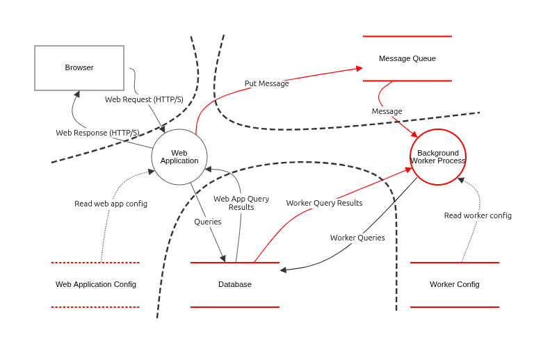

# Threat Modeling

- Analyzing representations of a system to highlight concerns about security and privacy characteristics
- The process by which potential threats can be identified and enumerated, and countermeasures prioritized

## Threat Modeling Process (four-question model)

> <https://cheatsheetseries.owasp.org/cheatsheets/Threat_Modeling_Cheat_Sheet.html>

1. **System Modeling** (*what are we building?*)
   - Create a visual representation of the application/infrastructure being analyzed.
   - Most approaches start with a [data flow diagram](https://en.wikipedia.org/wiki/Data-flow_diagram).
   - Tooling: OWASP Threat Dragon, Microsoft Threat Modeling Tool, PyTM, draw.io, ...

2. **Threat Identification** (*what can go wrong?*)
   - Use a [framework](https://en.wikipedia.org/wiki/Threat_model#Threat_modeling_frameworks) (e.g., STRIDE, PASTA, OCTAVE, ...) to list and categorize possible threats
   - Use a mathematical approach (e.g., CVSS Score) to rank and prioritize threats.
   - One may also use [attack trees](https://en.wikipedia.org/wiki/Attack_tree) at this stage to help identifying threats.

3. **Countermeasures** (*what are we going to do about it?*)
   - **Mitigate**: Take action to reduce the likelihood that the threat will materialize.
   - **Eliminate**: Simply remove the feature or component that is causing the threat.
   - **Transfer**: Shift responsibility to another entity such as the customer.
   - **Accept**: Do not mitigate, eliminate, or transfer the risk because none of the above options are acceptable given business requirements or constraints.

4. **Review** (*Did we do a good enough job?*)
   <details>
   <summary><b>Checklist of questions to ask</b></summary>
   <ul>
   <li>Does the DFD (or comparable) accurately reflect the system?</li>
   <li>Have all threats been identified?</li>
   <li>For each identified threat, has a response strategy been agreed upon?</li>
   <li>For identified threats for which mitigation is the desired response, have mitigation strategies been developed which reduce risk to an acceptable level?</li>
   <li>Has the threat model been formally documented? Are artifacts from the threat model process stored in such a way that it can be accessed by those with &quot;need to know&quot;?</li>
   <li>Can the agreed upon mitigations be tested? Can success or failure of the requirements and recommendations from the threat model be measured?</li>
   </ul>
   </defails><br>

## Practice

1. Deploy [OWASP Threat Dragon](https://github.com/OWASP/threat-dragon/) server using a `docker-compose.yaml` file ([demo by the creator](https://www.youtube.com/watch?v=n6JGcZGFq5o)).

   > Alternatively, download the desktop application from [releases page](https://github.com/OWASP/threat-dragon/releases/).

   ```yaml
   services:
     threat-dragon:
       image: threatdragon/owasp-threat-dragon:stable
       ports:
       - 3000:3000
       command: |
         sh -c 'wget -O /app/.env https://github.com/OWASP/threat-dragon/raw/refs/heads/main/minimal.env && node td.server/index.js'
   ```

2. Start the server, access at <http://localhost:3000>

   ```bash
   docker compose up -d
   ```

3. Login to local session -> Explore a sample threat model -> Demo threat model

   
