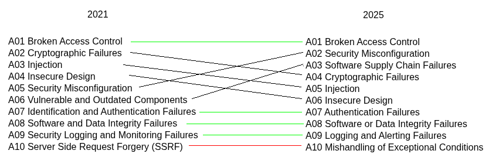
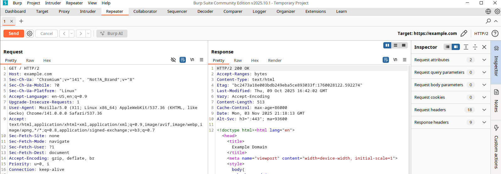

# OWASP Top 10

> <https://owasp.org/Top10/>

Enumeration of the top 10 most critical security risks to web applications. A widely-accepted first step towards changing the software development culture within an organization into one that produces more secure code.

## Changes from 2017 - 2021

## Changes from 2021 - 2025

## Slides

Refer to the PDF slides (included in this repo) for theoretical and practical explanations.

## Practice

1. Install [Burp Suite](https://portswigger.net/burp/releases/community/latest) or a similar tool (e.g., [Caido](https://github.com/caido/caido), [OWASP ZAP](https://www.zaproxy.org/download/), [MITM-Proxy](https://www.mitmproxy.org/#mitmweb)).

1. Use the bundled browser in Burp, or configure request/response interception via an HTTP proxy (e.g., FoxyProxy browser extension).

1. Intercept a request to <https://example.com> and send it to the repeater.

    

## Resources

- HTTP Header Reference: <https://developer.mozilla.org/en-US/docs/Web/HTTP/Reference/Headers>
- Practice Labs: <https://portswigger.net/web-security/all-topics>
- Payload Database: <https://github.com/swisskyrepo/PayloadsAllTheThings>
- CTF-focused Blog: <https://book.jorianwoltjer.com/web/client-side>
- Recommended Channel: <https://www.youtube.com/playlist?list=PLI_rLWXMqpSl_TqX9bbisW-d7tDqcVvOJ>
