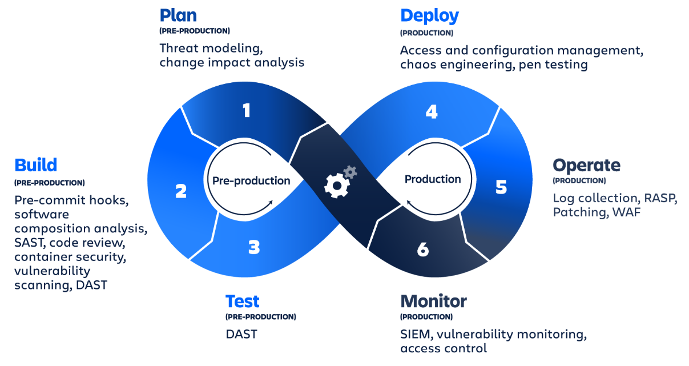

# DevSecOps

DevSecOps is about incorporating security practices into all stages of SDLC, utilizing tooling to automate repetitive activities.

## Topics of Interest

1. Threat Modeling & Risk Assessment
1. Application Security Testing (SAST, DAST, IAST, Fuzzing)
1. Secret Detection and Management
1. Software Composition Analysis (scanning image, infrastructure, and dependency manifests)
1. Vulnerability Management (identification, evaluation, addressing, and reporting)
1. Security Monitoring & Alerting
1. Compliance Management
